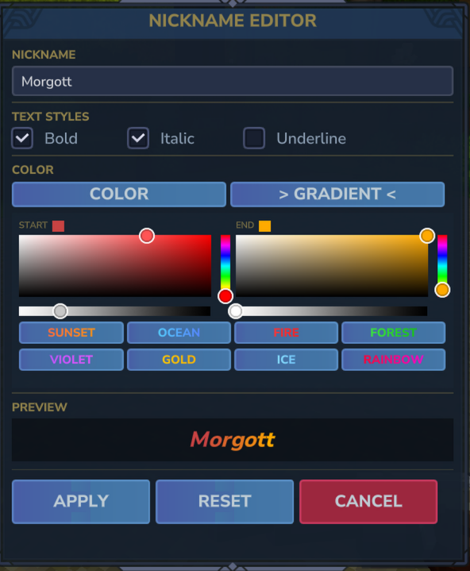

# NickNameChanger

A server-side plugin for Hytale that allows players to customize their display nickname with colors, gradients, and text styles.

## Features

- **UI Editor** — Graphical interface for nickname customization
  - 12 preset colors + custom color picker
  - 8 gradient presets + custom gradient colors
  - Text styles: Bold, Italic, Underline
  - Live preview
- **Chat** — Custom nickname displayed in chat messages
- **Nameplate** — Nickname shown above player's head
- **Map** — Custom name displayed on the world map
- **Tab List** — Nickname visible in the player list
- **LuckPerms** — Optional integration for chat formatting compatibility

## Commands

| Command | Description |
|---------|-------------|
| `/nick` | Open the nickname editor UI |
| `/nick <name>` | Set a nickname via command |
| `/nick reset` | Reset to your original username |

## Installation

1. Place `NickNameChanger-*.*.*.jar` into `Hytale\UserData\Mods`
2. Launch the game and open world settings
3. Enable the mod in the Mods section
4. Load the world

## Optional Dependencies

- **[LuckPerms](https://luckperms.net/)** — If installed, nicknames will sync to LuckPerms `display-name` meta for chat formatting compatibility

## Limitations

- **Inventory header** — Cannot be changed as it is rendered client-side

## Localization

- English (en-US)
- Russian (ru-RU)

---

# NickNameChanger (Русский)

Серверный плагин для Hytale, позволяющий игрокам менять отображаемый никнейм с цветами, градиентами и стилями текста.

## Возможности

- **UI Редактор** — Графический интерфейс для настройки никнейма
  - 12 готовых цветов + выбор произвольного цвета
  - 8 готовых градиентов + произвольные цвета градиента
  - Стили текста: Жирный, Курсив, Подчёркнутый
  - Превью в реальном времени
- **Чат** — Никнейм отображается в сообщениях чата
- **Табличка над головой** — Имя над персонажем
- **Карта** — Имя на карте мира
- **Таб-лист** — Никнейм в списке игроков
- **LuckPerms** — Опциональная интеграция для совместимости с форматированием чата

## Команды

| Команда | Описание |
|---------|----------|
| `/nick` | Открыть редактор никнейма |
| `/nick <имя>` | Установить никнейм через команду |
| `/nick reset` | Сбросить на оригинальное имя |

## Установка

1. Поместите `NickNameChanger-*.*.*.jar` в папку `Hytale\UserData\Mods`
2. Запустите игру и откройте настройки мира
3. Включите мод в разделе Mods
4. Загрузите мир

## Опциональные зависимости

- **[LuckPerms](https://luckperms.net/)** — Если установлен, никнеймы будут синхронизироваться с мета-значением `display-name` в LuckPerms

## Ограничения

- **Шапка инвентаря** — Невозможно изменить, так как отрисовывается на стороне клиента

## Локализация

- Английский (en-US)
- Русский (ru-RU)
