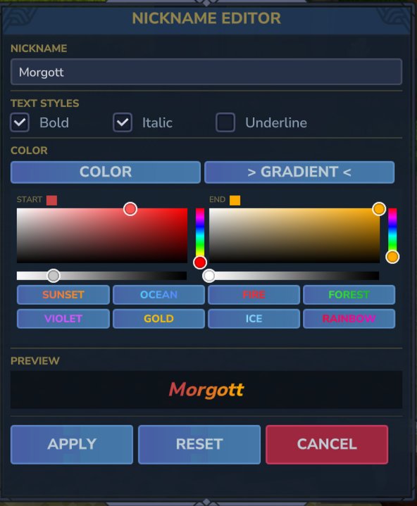

# NickNameChanger

[](README.md) [](README.ru.md)

> **Note:** Version 0.0.11 requires Hytale **Release** (February 2026+).

A server-side plugin for Hytale that allows players to customize their display nickname with colors, gradients, and text styles.



## Features

- **UI Editor** — Graphical interface for nickname customization
  - 12 preset colors + custom color picker
  - 8 gradient presets + custom gradient colors
  - Text styles: Bold, Italic, Underline
  - Live preview
- **Message Color** — Per-player chat message coloring via UI tab or command
- **Chat** — Custom nickname displayed in chat messages
- **Nameplate** — Nickname shown above player's head
- **Map** — Custom name displayed on the world map (configurable)
- **Tab List** — Nickname visible in the player list
- **Nickname Validation** — Configurable rules: min/max length, banned words, Cyrillic support, unique nicknames
- **Tag Injection Protection** — Only safe markup tags are allowed (color, gradient, bold, italic, underline)
- **Admin Settings GUI** — Toggle nickname display globally with instant effect on all players
- **Configuration** — Control where nicknames appear via `config.json` or admin GUI
- **LuckPerms** — Prefix/suffix in chat with hex color support (`<#RRGGBB>`)
- **API** — Public API for other plugins to read player nicknames and display settings

## Commands

| Command | Description |
|---------|-------------|
| `/nick` | Open the nickname editor UI |
| `/nick <name>` | Set a nickname via command |
| `/nick reset` | Reset to your original username |
| `/nick msgcolor <hex>` | Set chat message color (e.g. `/nick msgcolor #FF5555`) |
| `/nick msgcolor gradient:#HEX1:#HEX2` | Set message gradient color |
| `/nick msgcolor reset` | Reset message color to default |
| `/nick settings` | Open admin settings panel (requires `nickname.admin`) |

## Installation

1. Place `NickNameChanger-0.0.11.jar` into `Hytale\UserData\Mods`
2. Launch the game and open world settings
3. Enable the mod in the Mods section
4. Load the world

## Permissions

| Permission | Description | Default |
|---|---|---|
| `nickname.use` | Access to `/nick` command | Allowed |
| `nickname.format` | Use colors, gradients, bold/italic/underline | Allowed |
| `nickname.admin` | Access to `/nick settings` (admin display panel) | **Denied** |

### How permissions work

`nickname.use` and `nickname.format` are **allowed by default** — the mod works out of the box with no configuration. To restrict them, explicitly deny with the `-` prefix.

`nickname.admin` is **denied by default** — only explicitly granted players/groups can access the settings panel. This is an admin-only feature.

> **Note about OP and singleplayer:** The built-in Hytale `OP` group has a wildcard permission (`*`) which grants **all** permissions, including `nickname.admin`. In singleplayer the server owner is always OP, so `/nick settings` is accessible automatically. On a dedicated server, regular players are in the `Default` group and will **not** have access unless you grant `nickname.admin` explicitly.

### With LuckPerms

```
# Grant admin settings access to a specific player
/lp user Steve permission set nickname.admin true

# Grant admin settings access to an entire group
/lp group Admin permission set nickname.admin true

# Deny formatting for default group (players can still set plain nicknames)
/lp group default permission set -nickname.format true

# Deny /nick entirely for a specific player
/lp user Steve permission set -nickname.use true
```

### Without LuckPerms (`permissions.json`)

Edit `permissions.json` in your world's data folder. Groups are checked in order — assign players to groups via the Hytale server config.

```json
{
  "groups": {
    "OP": ["*"],
    "Admin": ["nickname.admin", "nickname.format"],
    "VIP": ["nickname.format"],
    "Default": []
  }
}
```

| Group | `/nick` | Colors/Gradients | `/nick settings` |
|-------|---------|------------------|-------------------|
| OP | Yes (`*`) | Yes (`*`) | Yes (`*`) |
| Admin | Yes (default) | Yes (granted) | Yes (granted) |
| VIP | Yes (default) | Yes (granted) | No (default denied) |
| Default | Yes (default) | Yes (default) | No (default denied) |

To **restrict** formatting for Default players, add `"-nickname.format"` to their group:

```json
"Default": ["-nickname.format"]
```

## Admin Settings Panel

The settings panel (`/nick settings`) gives administrators a GUI to control where nicknames appear globally.


### How it works

1. An admin opens `/nick settings` (requires `nickname.admin` permission)
2. Three checkboxes control global display:
   - **Show in Chat** — whether nicknames appear in chat messages
   - **Show on Nameplate** — whether nicknames appear above players' heads
   - **Show in Tab List / Map** — whether nicknames appear in the player list and on the world map
3. Click **Save** to apply changes

### What happens on save

- Settings are saved to `config.json` immediately
- **All online players are updated instantly** — no restart or rejoin required
- When a checkbox is **unchecked**: all players with nicknames revert to their original usernames in that context (nameplate, tab list, or chat)
- When a checkbox is **re-checked**: all nicknames are restored immediately
- Nicknames are never deleted — they remain stored and are simply shown or hidden based on the settings

### Important notes

- Settings are **global** — they affect ALL players on the server
- Only admins with `nickname.admin` permission can change these settings
- Changes persist across server restarts (saved to `config.json`)
- Players' stored nicknames are preserved regardless of display settings

## Configuration

The plugin generates a `config.json` in its data folder on first run:

```json
{
  "chatFormat": "{prefix}<{username}>{suffix} {message}",
  "display": {
    "showInChat": true,
    "showOnNameplate": true,
    "showInTabList": true,
    "showOnMap": false
  },
  "nicknames": {
    "minLength": 2,
    "maxLength": 32,
    "allowCyrillic": true,
    "allowUnicode": false,
    "uniqueNicknames": true,
    "bannedWords": ["admin", "moderator", "server", "owner"]
  },
  "integrations": {
    "luckperms": {
      "enabled": true,
      "showPrefix": true,
      "showSuffix": true
    }
  }
}
```

| Parameter | Description |
|-----------|-------------|
| `chatFormat` | Chat format with placeholders: `{prefix}`, `{username}`, `{suffix}`, `{message}` |
| `display.showInChat` | Show nicknames in chat messages |
| `display.showOnNameplate` | Show nicknames above players' heads |
| `display.showInTabList` | Show nicknames in the player list |
| `display.showOnMap` | Show nicknames on the world map (separate from tab list) |
| `nicknames.minLength` | Minimum nickname length (default: 2) |
| `nicknames.maxLength` | Maximum nickname length (default: 32) |
| `nicknames.allowCyrillic` | Allow Cyrillic characters in nicknames |
| `nicknames.allowUnicode` | Allow Unicode characters (emoji, CJK, etc.) |
| `nicknames.uniqueNicknames` | Prevent duplicate nicknames across players |
| `nicknames.bannedWords` | List of forbidden words (case-insensitive match) |
| `integrations.luckperms.enabled` | Enable LuckPerms integration |
| `integrations.luckperms.showPrefix` | Show LuckPerms prefix in chat |
| `integrations.luckperms.showSuffix` | Show LuckPerms suffix in chat |

> **Note:** The `display` settings can also be changed through the admin GUI (`/nick settings`), which is the recommended way since it applies changes instantly to all online players.

## API for Developers

Other plugins can read nickname data and display settings through the `NicknameAPI` class (`com.nickname.plugin.api.NicknameAPI`).

Add NickNameChanger as a `compileOnly` dependency in your `build.gradle.kts`:

```kotlin
compileOnly(fileTree("libs") { include("NickNameChanger-*.jar") })
```

### Nickname Methods

#### `getNickname(UUID uuid): String?`

Returns the raw nickname string with markup tags (e.g. `<color:#FF5555>Steve</color>`), or `null` if the player has no nickname.

```java
String nick = NicknameAPI.getNickname(playerUuid);
if (nick != null) {
    System.out.println("Player has nickname: " + nick);
}
```

#### `getDisplayName(UUID uuid, String defaultName): String`

Returns the player's nickname if set, otherwise returns `defaultName`. Never returns `null`.

```java
String name = NicknameAPI.getDisplayName(playerUuid, player.getUsername());
```

#### `hasNickname(UUID uuid): boolean`

Returns `true` if the player has a custom nickname set.

```java
if (NicknameAPI.hasNickname(playerUuid)) {
    // player is using a custom nickname
}
```

#### `getOriginalUsername(UUID uuid): String?`

Returns the player's real username before the nickname was set, or `null` if unknown.

```java
String original = NicknameAPI.getOriginalUsername(playerUuid);
```

### Display Settings Methods

These methods allow other plugins to check the current global display settings:

#### `isShowInChat(): boolean`

Returns `true` if nicknames are currently displayed in chat.

#### `isShowOnNameplate(): boolean`

Returns `true` if nicknames are currently displayed on nameplates (above head).

#### `isShowInTabList(): boolean`

Returns `true` if nicknames are currently displayed in the tab list and on the map.

```java
// Example: only format chat if nicknames are enabled in chat
if (NicknameAPI.isShowInChat() && NicknameAPI.hasNickname(uuid)) {
    String nick = NicknameAPI.getNickname(uuid);
    // use nickname in your chat plugin
}
```

### Notes

- All methods are **static** — no instance needed
- All methods are **thread-safe**
- The API is read-only — nicknames can only be set through `/nick` command or the UI
- If NickNameChanger is not loaded, all methods return `null` / `false` / `defaultName` / `true` safely
- Nickname strings may contain markup: `<color:...>`, `<gradient:...>`, `<b>`, `<i>`, `<u>`

## Compatibility

- **Hytale Release** (February 2026+) — Required for v0.0.11
- **[LuckPerms](https://luckperms.net/)** — Full support:
  - Nicknames sync to LuckPerms `display-name` meta
  - Chat displays LuckPerms prefix/suffix alongside the nickname
  - Hex color prefixes (`<#RRGGBB>`) are fully supported
  - Permissions can be managed through LuckPerms
  - `nickname.admin` integrates with LuckPerms groups
- **EtherealPerms** — Compatible. The plugin preserves other chat formatters when a player has no nickname set.
- **Other chat plugins** — NickNameChanger only overrides chat formatting for players with active nicknames or LuckPerms integration.

## Limitations

- **Inventory header** — Cannot be changed as it is rendered client-side

## Localization

- English (en-US)
- Russian (ru-RU)
- Portuguese - Brazil (pt-BR)

## Credits

- **Author:** Morgott
